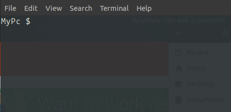

# Bached 

### Customized terminal *Postscript* `PS1` 

This repositoriy contains a list of ways in which you can customize your terminal __PostScript__. e.g. Showing the current branch for a git folder, or using icons in the terminal both directly or using octals, and using true colors in bash.

* [My Configuration](#my_configuration)
* [Customizations](#customizations)
    * [Editing PS1](#customizations_editing)
        * [In Terminal](#customizations_editing_in_terminal)
        * [In Bashrc](#customizations_editing_in_bashrc)
    * [Escape Sequences](#customizations_escape_sequencesustomizations_escape_sequences)
    * [Color](#customizations_color)
        * [Foreground Color](#customizations_color_forecolor)
        * [Background Color](#customizations_color_backcolor)
        * [Composed](#customizations_color_composed)
        * [Stopping the Propagation](#customizations_color_stop_propagation)
        * [RGB Colors](#customizations_color_rgb)
    * [Some Tweaks](#customizations_some_tweaks)
        * [Bold](#customizations_some_tweaks_bold)
        * [Italic](#customizations_some_tweaks_italic)
        * [Underline](#customizations_some_tweaks_underline)
        * [Strike through](#customizations_some_tweaks_strikethrough)
        * [Blinking Text](#customizations_some_tweaks_blinking_text)
    * [Adding Icons to Prompt](#customizations_adding_icons)
        * [Direct Pasting](#customizations_adding_icons_direct)
        * [Converting to Octals](#customizations_adding_icons_to_octals)
    * [Sugar Code](#customizations_sugarcode)
        * [Variables](#customizations_sugarcode_variables)
        * [Functions](#customizations_sugarcode_functions)
* [Contributing](#contributing)
* [Contributors](#contributors)

## <a name="my_configuration">My Configuration</a>

This Repo also contains my customized terminal script. To use it do the following steps:

1. Clone the Repo

    ```bash
        $ git clone https://github.com/vermakartik/bached.git
    ```
2. Create a copy of the original `.bashrc` file:

    ```bash
        $ mv ~/.bashrc ~/.bashrc.original
    ```
3. Now replace the .bashrc with my customized terminal script
    
    ```bash
        $ cp ./bached/.bashrc ~/.bashrc
    ```

4. Open a new terminal or use the following command to view changes in the current terminal window
    ```bash
        $ source ~/.bashrc
    ```
## <a name="customizations">Customizations</a>

### <a name="customizations_editing">Editing PS1</a>

To make changes to the terminal script we must make changes to the `PS1` environment variable.

#### <a name="customizations_editing_in_terminal">In Terminal</a>

It is possible to directly edit the variable `PS1` in terminal. To do so

Open a new Terminal and enter the following line:
```bash
    $ PS1='MyPc $'
```

This will display as it is, but we will llive earn how to add customizations to it soon.

Now your terminal should like this
<div style="text-align:center;">
    
</div>

#### <a name="customizations_editing_in_bashrc">In .bashrc</a>

Open `~/.bashrc` and look for the variable `PS1`. Any changes that are desired in the terminal should be done in this variable.

### <a name="customizations_escape_sequences">Escape Sequences</a>

Escape sequences can be used in `ps` to add some details like the current working directory, or directory path, or username to the terminal.

e.g

```bash
    $ PS1='\W > '
```


will show the current working directory. To show the complete/absolute path we can use 

```bash
    $ PS1='\w > '
```

<div style="text-align:center">
    
</div>

* There are a lot more sequences, but are not required for our purpose. To see a full list [visit this link](http://tldp.org/HOWTO/Bash-Prompt-HOWTO/bash-prompt-escape-sequences.html)

* Note that all of the escape sequences may not work on all the command line tools.

### <a name="customizations_color">Color</a>

There are basically two types of the colors that can be added to the bash prompt:

1. Foreground Color
2. Background Color

#### <a name="customizations_color_forecolor">Foreground Color</a>

There are some pre-defined colors that can be used in `ps` to provide some color to the text.

e.g, see the below line

```bash
    $ PS1='\[\e[31m\]\W > '
```
<div style="text-align:center">
    
</div>

Here color `\e` is an escape sequence with octal value `\033`, which makes sure that the given sequence should be interpreted as a special value.

Some of the predefined Colors for foreground available are:

Color Name | Code 
-----------|-----
Black| \\[\e[30m\\]
Red| \\[\e[31m\\]
Green| \\[\e[32m\\]
Yellow| \\[\e[33m\\]
Blue| \\[\e[34m\\]
Purple| \\[\e[35m\\]
Cyan| \\[\e[36m\\]
White| \\[\e[37m\\]

* Note. It is possible to use rgb color values in some terminals. See section on using [true colors](#truecolors) for learning about them.

#### <a name="customizations_color_backcolor">Background Color</a>

There are some predefined color sequences that can be used to provide a background color in `PS` e.g.

```bash
   $ PS1='\[\e[42m\]\W > '
```

<div style="text-align:center">
    
</div>

Color Name | Code 
-----------|-----
Black| \\[\e[40m\\]
Red| \\[\e[41m\\]
Green| \\[\e[42m\\]
Yellow| \\[\e[43m\\]
Blue| \\[\e[44m\\]
Purple| \\[\e[45m\\]
Cyan| \\[\e[46m\\]
White| \\[\e[47m\\]

#### <a name="customizations_color_composed">Composed</a>

You can also combine foreground and background values. Just add them before the string value you want to seperated by a semicolon `;` customize. e.g.

```bash
    $ PS1='\[\e[37;41m\]\w >'
```

here `37` is for foreground and `41` represents background color.

<div style="text-align:center">
    
</div>

#### <a name="customizations_color_stop_propagation">Stoping the Propagation</a> 

You must have noticed that the changes that we make affect not only the text in `PS1` but also to the text we write, to stop the same from happening add following escape code at the position where you don't want changes to occur.

__`\[\e[0m\]`__

e.g
```bash
    $ PS1='\[\e[42m\]\W > \[\e[0m\]'
```
#### <a name="customizations_color_rgb">RGB Color</a>

* Note that true color is not supported by all the terminals. This is written assuming you are using a gnome terminal.

* __Foreground Color__. Use the following escape sequence to provide a rgb foreground color.

```bash
    \[\e[38;2;{R};{G};{B}m\]
```

where 

`38` is the code which defines that we want to use rgb color value<br />
{R} - Red value(0 to 255)<br />
{G} - Green value(0 to 255)<br />
{B} - Blue value(0 to 255)<br />

* __Background Color__. Use the following escape sequence to provide a rgb background color.

```bash
    \[\e[48;2;{R};{G};{B}m\]
```

where 

`48` is the code which defines that we want to use rgb color value<br />
and R, G, B are same as in the previous case.

e.g.

```bash
    PS1='\[\e[38;2;145;255;45m\]\[\e[48;2;124;37;198m\]\W >\[\e[0m\]'
```

<div style="text-align:center">
    
</div>

### <a name="customizations_some_tweaks">Some tweaks</a>

* <a name="customizations_some_tweaks_bold">__Bold__</a>. To make the prompt text bold add the code
`\[\e[1m\]` before text.

```bash
    $ PS1='\[\e[1m\] \W $\[\e[0m\]'
```
<div style="text-align:center">
    
</div>

* <a name="customizations_some_tweaks_italic">__Italic__</a>. `\[\e[3m\]`

```bash
    $ PS1='\[\e[3m\] \W $\[\e[0m\]'
```
<div style="text-align:center">
    
</div>

* <a name="customizations_some_tweaks_underline">__Underline__</a>. `\[\e[4m\]`

```bash
    $ PS1='\[\e[4m\] \W $\[\e[0m\]'
```
<div style="text-align:center">
    
</div>

* <a name="customizations_some_tweaks_strikethrough">__Striketrough__</a>. `\[\e[9m\]`

```bash
    $ PS1='\[\e[9m\] \W $\[\e[0m\]'
```

<div style="text-align:center">
    
</div>

* <a name="customizations_some_tweaks_blinking_text">__Blinking Text__</a>. `\[\e[\5m]`

```bash
    $ PS1='\[\e[5m\] \W $\[\e[0m\]'
```

* <a name="customizations_some_tweaks_composed">__Composed__</a>. It also possible to combine various codes. Just seperate them by semi-colon as shown below.

```bash
    $ PS1='\[\e[1;3;9m\]'
```

<div style="text-align:center">
    
</div>

### <a name="customizations_adding_icons">Adding Unicode Icons to prompt</a>

Icons can also be added to the prompt.
Icons are added to the terminal as unicode characters. There are two approaches to this that work for me.

* <a name="customizations_adding_icons_direct">__Directly Pasting the icon__</a>. To get any icon into the bash prompt directly paste it into the `ps`. e.g.

```bash
    $ PS1="🎭 > "
```

<div style="text-align:center">
    
</div>

This is an emoji that i have copied as such from [emojipedia](https://emojipedia.org/activity/). You can put any emoji that you like.

* <a name="customizations_adding_icons_to_octals">__Converting to octals__</a>. Other way of getting icon into the bash prompt is by getting the equivalent __octal__ code and putting it in `ps`.

e.g 

```bash
    $ PS1=' \360\237\216\255 $ '
```
<div style="text-align:center">
    
</div>

Here I find a good short hand on [StackOverflow](https://stackoverflow.com/a/5760420) to convert the icon to its equivalent hex-code.

```bash
    $ var="$(echo -n '🎭' | od -An -tx1)"; printf '\\x%s' ${var^^}; echo
    > \xF0\x9F\x8E\xAD # output
```

convert each hex to equivalent octal and paste into `ps` as shown above. 

### <a name="customizations_sugarcode">Sugar Code</a>

Your `PS` may soon become cumbersome and hard to read once you start adding more such colors and icons to the __PostScript__. e.g., Something like

```bash
    $ PS1='\360\237\216\255\[\e[1m\]\[\e[38;2;190;214;192m\]\[\e[48;2;170;111;0m\] \W \[\e[38;2;141;224;221m\]\[\e[48;2;48;135;35m\] $ \[\e[0m\]'
```
<div style="text-align:center">
    
</div>

There are a few ways in which `ps` can be made compact and readable

#### <a name="customizations_sugarcode_variables">Variables

To make your PS more readable we can use variables in string. e.g. the above PS can be converted as shown below:

```bash
    $ PS_ICON='\360\237\216\255'
    $ PS_DIR_F_COL='\[\e[38;2;190;214;192m\]'
    $ PS_DIR_B_COL='\[\e[48;2;170;111;0m\]'
    $ PS_DOLLAR_F_COL='\[\e[38;2;141;224;221m\]'
    $ PS_DOLLAR_B_COL='\[\e[48;2;48;135;35m\]'
    $ PS_STOP='\[\e[0m\]'
    $ PS_BOLD='\[\e[1m\]'
    $ PS1=''"$PS_ICON$PS_BOLD$PS_DIR_F_COL$PS_DIR_B_COL"' \W '"$PS_DOLLAR_F_COL$PS_DOLLAR_B_COL"' $ '"$PS_STOP"
```

Now this not only make it more readable but also makes it easy to make any changes or debug it.

Obviously, there are other ways in which we can declare the variables e.g. code for Directory and Dollar can be combined individually together as shown below:

```bash
    $ PS_DIR="$PS_DIR_F_COL$PS_DIR_B_COL \W "
    $ PS_SYM="$PS_DOLLAR_F_COL$PS_DIR_B_COL $ "
    $ PS1=''"$PS_BOLD$PS_ICON$PS_DIR$PS_SYM$PS_STOP"''
```

Now, this achieves the same effect, but is more readable and compact.

#### <a name="customizations_sugarcode_functions">Functions</a>

Still there is one more thing that can be done to make the code not only more compact but acheive dynamic prompt behaviour based on conditions and that is __functions__

e.g in the previous variables example we have to declare the colors values from scratch which can create bugs and can be daunting as well. This can be converted into a function as shown below.

```bash
   $ foreColor() { echo "\[\e[38;2;$1;$2;$3m\]"; } 
   $ backColor() { echo "\[\e[48;2;$1;$2;$3m\]"; }
   $ PS_DIR="$(foreColor 190 214 192)$(backColor 170 111 0) \W "
   $ PS_DOLLAR="$(foreColor 141 224 221)$(backColor 48 135 35) $ "
   $ PS1=''"$PS_ICON$PS_BOLD$PS_DIR$PS_DOLLAR$PS_STOP"''
```

## Contributing

To contribute do the following steps:

1. Fork the Repo

2. clone the local version of Repo:
    ```bash
        $ git clone https://github.com/{username}/bached.git
    ```
2. Make your changes in the README.md file.

3. Commit your changes

    ```bash
        $ git commit -a -m 'Made the [...] changes'
    ```

4. Push your changes

    ```bash
        $ git push origin master
    ```
5. Now send your pull request.

## Contributors

* [Kartik Verma](https://github.com/vermakartik)


